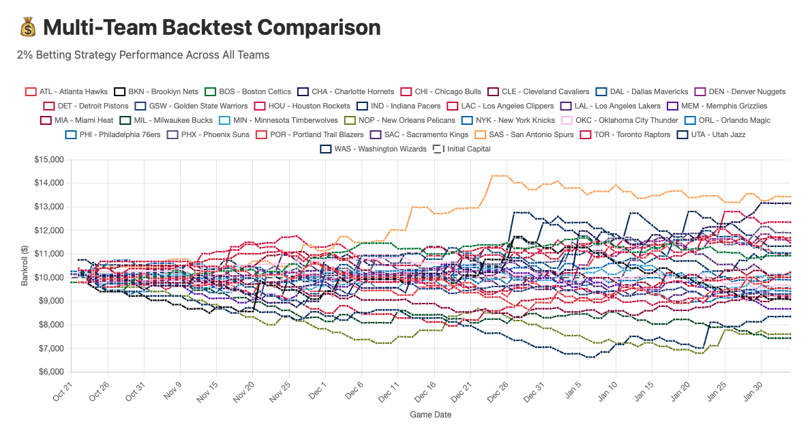
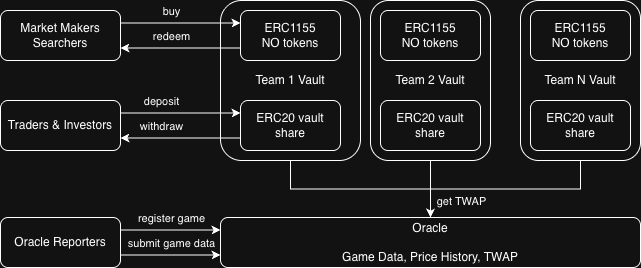

# Unexpected Sports Market

> **Built for [ETH Global Hack Money 2026](https://ethglobal.com/)**

A tokenized, automated betting vault that turns prediction market positions into a passive derivative tracking an NBA team's season-long performance.


## TL;DR

**Set-and-forget NBA betting vaults. Deposit USDC, get automated season-long team exposure.**

Unexpected Sports creates a **new financial primitive**: tokenized vaults that give passive, season-long exposure to NBA teams. Using an **intent-based architecture**, the vault automatically sells prediction market NO tokens and streams bets over 48 hours (DCA entry). Your ERC-20 shares go up when the team wins, down when it loses — no manual betting, no addiction loop. As a side effect, we create a permissionless **on-chain sports oracle** for moneyline probability data.

## Key Contributions

1. **New Financial Primitive** — A tokenized vault derivative whose value tracks a team's season performance passively, without any user action after deposit.
2. **Intent + Searcher Architecture** — The vault expresses intent to sell NO tokens; off-chain market makers fill the orders. This avoids hard-coding a prediction market integration and is composable with any settlement layer.
3. **DCA Entry Strategy** — Streaming the bet over 48 hours reduces slippage and front-running risk.
4. **On-Chain Sports Oracle** — As a side effect, the protocol creates a permissionless, on-chain oracle for moneyline probability data that any other contract can consume.

## Problem

Prediction markets let you bet on individual games, but there is no easy way to get **season-long financial exposure** to a team's performance. Today you have to:

- **Manually place bets** every game, all season
- **Size each bet correctly** so you don't blow up your bankroll
- **Resist distractions** — platforms push you toward other markets and parlays
- **Avoid addiction** — the constant engagement loop of sports betting is by design

There is no "buy and hold" equivalent for sports fans who just want upside if their team has a great season.

## Solution

Unexpected Sports Market creates **per-team ERC-4626-style vaults** that automate everything:

| Feature | How It Works |
|---|---|
| **Deposit** | Send USDC to a team vault, receive ERC-20 shares |
| **Automated Betting** | The vault sells NO tokens worth 2% of its balance on every game |
| **Intent-Based Execution** | Off-chain searchers/market makers fill NO token orders — no direct prediction market integration |
| **Rate-Limited Withdrawals** | Daily deposit/withdraw caps prevent manipulation and ensure stable bet sizing |
| **Transparent Pricing** | Share price = USDC balance + mark-to-market value of open bets, updated via on-chain oracle |

The result is a **derivative token** whose price:
- **Short term:** Goes up when the team wins, down when it loses
  - This makes it a derivative to support leveraged sports betting
- **Long term:** Outperforms if the team has an unexpectedly good season
  - This makes it a non-correlated asset to be added to investment portfolios

### Validating the Derivative's Performace

We backtested the 2% fixed-bet strategy against real Polymarket price data for every NBA team in the 2025–26 season. Starting with $10,000, the chart below shows how each team's vault would have performed:

The results reveal that simply having a winning season isn't enough to guarentee returns. The prediction market moneyline odds make it so a team must have an **UNEXPECTEDLY** good (bad) season to see a positive (negative) return. "Blue Chip" teams that do well and are _expected to do well_ would not nessecarily see long term appreciation in the asset. However, it still holds in the short term if a team wins, its share price appreciates which.




## Architecture



### How a Game Flows

```
1. Admin registers a game in the Oracle and the team Vault
2. T-48h: Vault checkpoints its USDC balance and computes 2% allocation
3. T-48h → T-0: NO tokens become available for purchase, streamed over 48 hours
4. Searchers buy NO tokens at oracle-derived market price
5. Game starts — no more bets
6. Game ends:
   • Team wins → Vault keeps the USDC from NO token sales (profit)
   • Team loses → NO token holders redeem their tokens for USDC from the Vault
```

### How It's Made

The protocol has three components:

**On-Chain (Solidity / Foundry)**
- **Oracle** — Stores game metadata (teams, slug, game time) and time-series YES/NO price observations. Supports TWAP queries over arbitrary time ranges. Authorized reporters post prices; data is publicly readable by any contract.
- **Team Vault** (interface defined, implementation in progress) — ERC-20 share token representing pro-rata claim on vault assets. Accepts USDC deposits, mints shares, burns on withdrawal. Sells NO tokens per game to searchers/market makers. Rate-limits deposits and withdrawals to prevent manipulation.

**Off-Chain (Python)**
- **Data Pipeline** — Fetches hourly YES/NO price history from Polymarket's Gamma and CLOB APIs for every NBA game. Stores data in SQLite and CSV files. Powers the backtest engine that validates the 2% strategy across all 30 NBA teams.
- **Web Server** — Flask app serving backtest results, price history charts, and game analysis via REST API + HTML dashboards.

**Frontend** (spec defined)
- React app for depositing USDC, viewing share price history, and browsing per-game NO token liquidity.

## Project Structure

```
team-tokens/
├── contracts/                # Solidity smart contracts (Foundry)
│   ├── src/
│   │   ├── Oracle.sol        # Game registry + price observation storage + TWAP
│   │   └── interface/
│   │       ├── IOracle.sol   # Oracle interface & data structs
│   │       └── ITeamVault.sol# Vault interface (deposit, withdraw, buy NO, redeem)
│   ├── test/
│   │   └── Oracle.t.sol      # Comprehensive Foundry tests for Oracle
│   ├── lib/                  # OpenZeppelin v5.5, forge-std v1.9.6
│   └── foundry.toml
│
├── backend/                  # Python data pipeline & backtest engine
│   ├── main.py               # Polymarket price history extraction
│   ├── polymarket_client.py  # Gamma & CLOB API client
│   ├── database.py           # SQLite storage, backtest simulation, analysis
│   ├── data_writer.py        # CSV output utilities
│   ├── web_server.py         # Flask web server (API + dashboards)
│   ├── config.py             # All 30 NBA teams, API config, game schedules
│   ├── generate_game_slugs.py# Game slug generation from schedule data
│   ├── game_slugs.csv        # Full 2025-26 NBA schedule with Polymarket slugs
│   ├── price_history/        # Per-game hourly price CSVs
│   ├── templates/            # HTML templates (backtest, price history)
│   └── static/               # CSS + JS for dashboards
│
├── frontend/                 # React app (spec defined)
│   └── SPEC.md
│
└── images/                   # Architecture diagrams, backtest charts
```

## Smart Contracts

### Oracle (`Oracle.sol`)

The Oracle is fully implemented and tested. It is an `Ownable` contract that:

- **Registers games** with a Polymarket slug, home/away teams, and game time. Game IDs are derived as `keccak256(slug)`.
- **Records price observations** — authorized reporters post timestamped YES/NO prices. Observations must be strictly ordered.
- **Serves TWAP queries** — `getTwapPrice(gameId, startTime, endTime)` computes time-weighted average YES/NO prices over any range.
- **Serves latest prices** — `getLatestPrice(gameId)` for real-time price feeds.

### Team Vault (`ITeamVault.sol`)

The Vault interface is defined. Key functions:

| Role | Function | Description |
|---|---|---|
| Admin | `registerGame(gameId)` | Add a game for the vault to trade |
| Depositor | `deposit(amount, minShares)` | Deposit USDC, receive shares |
| Depositor | `withdraw(shares, minAmount)` | Burn shares, receive USDC |
| Market Maker | `buy(gameId, amount, isYes, minShares)` | Buy NO tokens from the vault |
| Market Maker | `redeem(gameId, shares, minAmount)` | Redeem NO tokens post-game |
| View | `getSharePrice()` | Current share price (USDC + open bet MTM) |

## Backend

### Data Pipeline

The backend collects real price data from Polymarket for every NBA game in the 2025–26 season:

1. **`main.py`** — Iterates through all games in `game_slugs.csv`, resolves Polymarket token IDs via the Gamma API, fetches hourly price history from the CLOB API, and writes per-game CSVs.
2. **`database.py`** — Loads CSV data into SQLite, provides filtered queries by team, computes 48-hour average prices, determines game outcomes, and runs the backtest simulation.
3. **`web_server.py`** — Flask server with endpoints:
   - `GET /api/games?team=PHI` — List games for a team
   - `GET /api/price-history/<game_id>?team=PHI` — Hourly price data
   - `GET /api/backtest?team=PHI` — Backtest results for one team
   - `GET /api/backtest-all-teams` — Backtest results across all 30 teams
   - `GET /api/game-analysis?team=PHI` — Per-game ROI analysis

### Running the Backend

```bash
cd backend
pip install requests flask
python main.py              # Extract price data from Polymarket
python database.py          # Load CSVs into SQLite + generate analysis
python web_server.py        # Start Flask server on port 5000
```

## Getting Started

### Prerequisites

- [Foundry](https://book.getfoundry.sh/getting-started/installation) (for smart contracts)
- Python 3.7+ with `requests` and `flask`

### Build & Test Contracts

```bash
cd contracts
forge build
forge test
```

### Run the Backtest Dashboard

```bash
cd backend
pip install requests flask
python database.py          # Initialize DB from price history CSVs
python web_server.py        # Open http://localhost:5000/backtest
```

## License

MIT 
